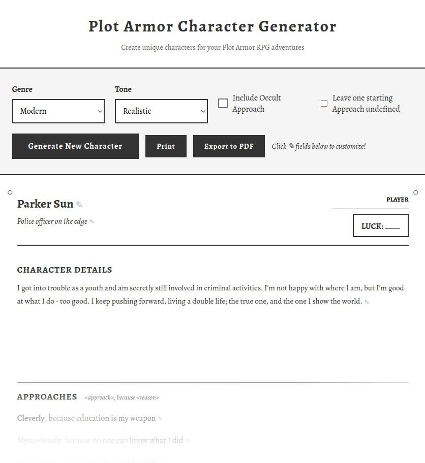

# Plot Armor Character generator

You can find this generator [deployed online here][generator]!

This repository contains a full random character generation system for
the [Plot Armor][plotarmor] roleplaying game.

If you find bugs, or have good ideas on random backgrounds/blurbs strings,
[make an issue][newissue] or PR -  I'll review and add them!

## Functionality

The user is able to select the Genre (Modern, Fantasy, Sci-fi, or Horror)
and Tone (Realistic, Dark, Lighthearted) of the game, and if they
want to include a Magical Approach or not. It also allows you to
skip defining one Approach (and fill it in during the game, as suggested
by the rule book).

If you want, you can tweak the character sheet (use the randomized text as
inspiration!), before printing or exporting to PDF!

## Implementation

This is built as a single-file JavaScript application,
embedded in an HTML file, for easily sharing and embedding in other pages.

[plotarmor]: https://griatch.itch.io/plot-armor-rpg
[generator]: https://griatch.github.io/plotarmor-chargen
[newissue]: https://github.com/Griatch/plotarmor-chargen/issues/new

## Screenshot 

